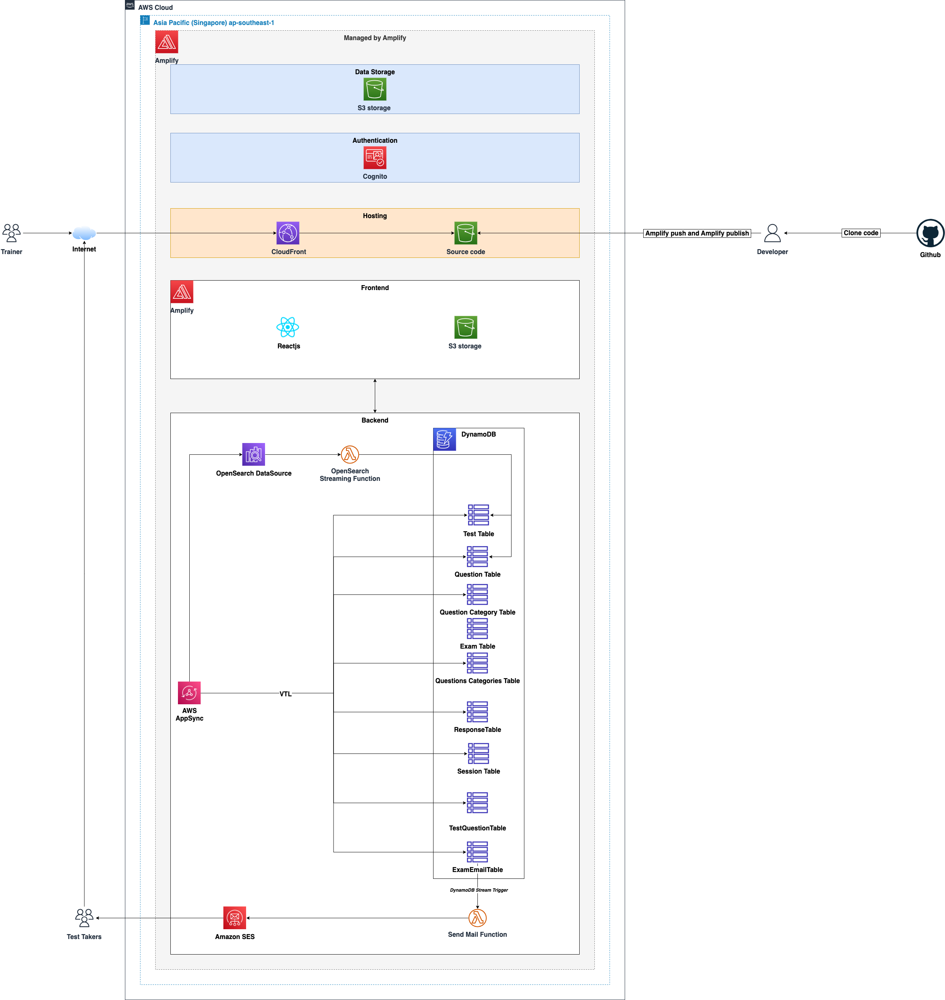
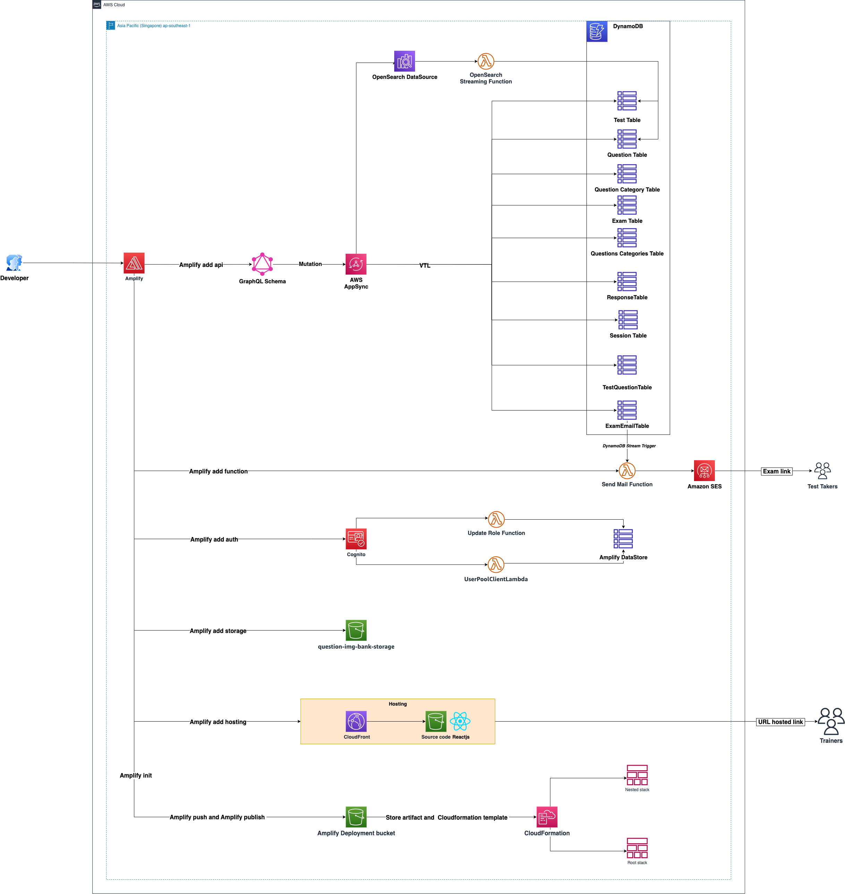
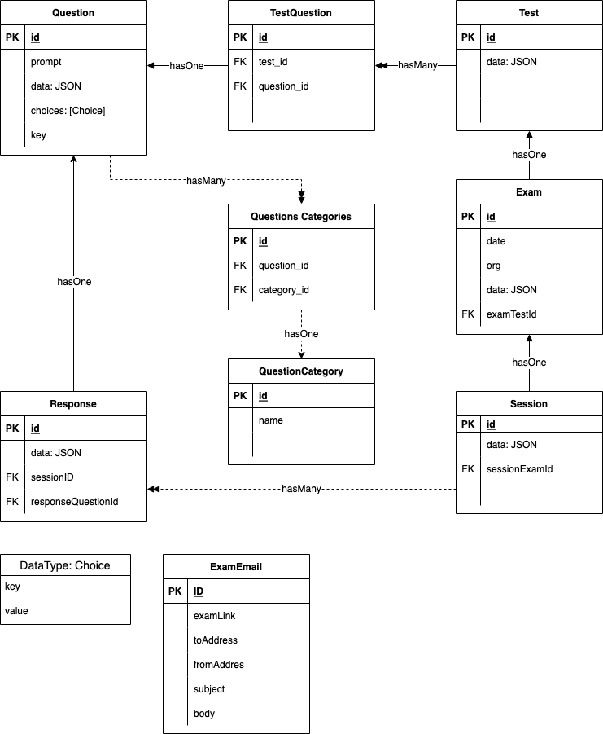

# FCJ Exam Platform 
<!-- description -->
This is a full-stack web application that provides a solution for online assessment - authoring test contents and delivering exams.

Key Features:

1. CRUD Operations: Administrators can manage the assessment content by performing CRUD operations on Questions, Tests, and Exams databases. This feature provides customization for the assessment materials.

3. Exam Delivery via Email: Once exams are ready for delivery, administrators can send exam links to the designated exam takers via email. This ensures a secure and personalized approach to exam distribution.

4. Automated Grading: The platform automatically grades the submitted answers, saving valuable time for educators and providing immediate feedback to the exam takers.

5. Customized Certificates: Upon successful completion of an exam, the FCJ Exam Platform generates customized certificates for the exam takers. These certificates can be easily downloaded, providing recognition for their achievements.

You can explore the functionalities of the FCJ Exam Platform by trying out the deployed application at the following link: **[FCJ Exam Platform Demo](https://d1swv02b0ramfa.cloudfront.net/)**

Demo Credentials:
- Username: testUser
- Password: testUser123

The entire application - frontend, backend, and all configuration - can be deployed in AWS cloud environment. 
&nbsp;

## Outlines
<!-- Table of content -->
- [Description](#description)
- [Built with](#built-with)
    - [Authorization](#authorization)
    - [Frontend](#frontend)
    - [Backend](#backend)
    - [Hosting](#hosting)
- [Architectures](#architecture)
    - [High level overview](#high-level-end-to-end)
    - [Frontend architecture](#frontend-architecture)
    - [Backend architecture](#backend-architecture)
    - [Detailed architecture](#detailed-architecture)
- [Cost](#cost)
- [Getting started](#getting-started)
    - [Prerequisites](#prerequisites)
    - [Installation](#installation)
        - [Set up Amplify environement](#set-up-amplify-environement)
        - [Build local dev environment](#build-local-dev-environment)
- [Know limitations](#known-limitations)
- [Future roadmap](#future-roadmap)

## Description

The project demonstrates the capabilities of AWS amplify in building cloud native full stack application. 

## Built with
<!-- add image, description and link of each library -->

### Authorization
- Cognito

### Frontend
- Amplify UI with React framework
- Amplify Connected components for authentication and data storage
- React Bootstrap
- MomentJS
- React Router
- UseImmer
- Js PDF
- React icons
- ReactMultiEmail

### Backend
- Database: DynamoDB
- AWS AppSync GraphQL API: Data management
- OpenSearch
- SES triggered by Lambda subcription to graphQL data change
- S3 storage 

### Hosting
- Cloudfront and S3: Build artifacts are stored in a S3 bucket where web application assets are maintained (web graphics, etc.). Amazon CloudFront caches the frontend content from S3, presenting the application to the user via a CloudFront distribution.

&nbsp;

## architectures

### High-level, end-to-end

### Devops architecture

### Entity relationship diagram

&nbsp;

## Cost

### Amazon Cognito 
Amazon Cognito user pools has a **free tier** of 50,000 MAUs per account for users who sign in directly to Amazon Cognito user pools and 50 MAUs for users federated through SAML 2.0 based identity providers.

https://aws.amazon.com/cognito/pricing/

### Amazon S3
As part of the AWS Free Tier, you can get started with Amazon S3 for free. Upon sign-up, new AWS customers receive 5GB of Amazon S3 storage in the S3 Standard storage class; 20,000 GET Requests; 2,000 PUT, COPY, POST, or LIST Requests; and 100 GB of Data Transfer Out each month.

https://aws.amazon.com/s3/pricing/

### AWS Amplify 
- Build frontend: free
- Create backend:
      - Amplify studio, CLI, libraries: No cost
      - AWS backend resources: Get started free, then pay as you go
- Host an app: Free for 12 months with limited capacity. Amplify switches over to pay as you go pricing once you exceed free tier limits, with no disruption to your apps.
 
 https://aws.amazon.com/amplify/pricing/

### Amazon simple mail service - SES
In a sandbox environment, you can use all of the features offered by Amazon SES; however, certain sending limits and restrictions apply (Daily sendind quota - 200 emails per 24-hour period, Maximum send rate - 1 email per second). When you’re ready to move out of the sandbox, submit a request for production access.

https://aws.amazon.com/ses/pricing/

### Amazon OpenSearch service
By default, Amplify CLI will configure a t2.small instance type
For customers in the AWS Free Tier, OpenSearch Service provides free usage of up to 750 hours per month of a t2.small.search or t3.small.search instance, and 10 GB per month of optional Amazon Elastic Block Store (EBS) storage. If you exceed the Free Tier usage limits, you will be charged the OpenSearch Service rates for the additional resources you use.

https://aws.amazon.com/opensearch-service/pricing/

## Getting started
To get your local up and running, please follow this set up guide:

### Prerequisites
- Install [Node.js®](https://nodejs.org/en/download), [NPM](https://docs.npmjs.com/getting-started), and [Git](https://git-scm.com/) if they are not already on your machine.
- Verify that you are running at least Node.js version 14.x, npm version 6.14.x, Git version 2.14.x or greater by running node -v and npm -v in a terminal/console window
- [Create AWS Account](https://portal.aws.amazon.com/billing/signup#/start/email). If you don't already have an AWS account, you'll need to create one in order to follow the next steps.
  
### Installation 

#### Set up Amplify environement 
- Create an empty directory and change current directory to that
- Run `amplify init --app <github url>`
- Follow prompts to install Amplify CLI and configure it to connect to your AWS account
- Check `src/aws-exports.js` is created
- Configure SES verified identities via SES Console.
For dev environment which use SES sandbox, only verified identities can send or receive emails via SES.
- Update lambda function environment variable:
  - Run `amplify update function`.
  - Choose `sendExamEmail` function
  - Variable name: `SES_EMAIL`
  - Variable value: an email address where email should be sent from. This email address should be verified in SES Console.

#### Build local dev environment 
- Run `npm install`
- Run `amplify push`
- Start local dev server: `npm start`
- Local dev server should run on `http://localhost:3000`

#### Deploy and Publish
- Configure hosting:
    - `amplify add hosting`
    - `amplify configure hosting` - choose Amazon S3 & Amazon Cloudfront
    - `amplify publish`, it may take 10-15 minutes. When published, the url to your website will be showed in the terminal.
      
## Known limitations
- The SES service is in a sandbox environment, which allows sending emails to verified identities only.
- A glitch on Sign in form where sometimes clicking "Sign up" button shows the Sign in tab and vice versa. 

## Future roadmap
- Question categories (for filtering and searching) were modeled in the database but the UI has not been implemented
- Create a text editor to enable rich content (styling, inserting image, hyperlink, etc) formatting for question prompt and choices
- Create Timer for Exam, schedule exam and activate link only on Exam date and time.
- Improvements to current features can be found in future-roadmap.text
